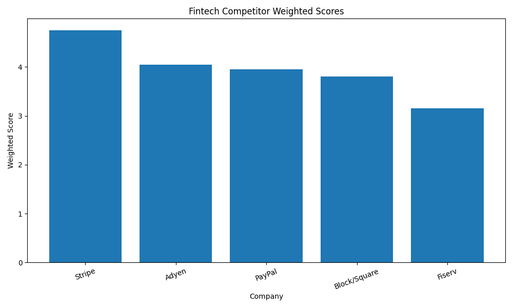
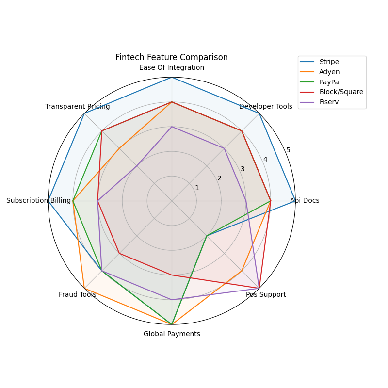

# Fiserv Developer Adoption Competitor Analyzer


Python-based product analysis tool comparing **Fiserv** with major fintech competitors using a **weighted developer-adoption scoring model**.

---

# Project Summary

This project simulates how a **product management intern** might structure competitive research and translate qualitative product insights into structured analysis.

The tool evaluates how attractive different fintech platforms are from a **developer ecosystem perspective**, focusing on factors like:

* API documentation quality
* developer tools and SDK availability
* ease of integration
* fraud tooling
* global payments support

The analysis compares **Fiserv** with major fintech competitors including:

* Stripe
* PayPal
* Block / Square
* Adyen

---

# Why This Project Exists

Modern fintech platforms grow by building strong **developer ecosystems**.

Companies with clear APIs, strong documentation, and easy integrations tend to achieve faster adoption from merchants, partners, and developers.

Product teams therefore need ways to evaluate competitor platforms across technical and product-experience dimensions.

This project demonstrates a **structured, data-driven approach** to that evaluation.

---

# Key Project Highlights

* Built a **Python-based competitor analysis framework** comparing 5 fintech platforms
* Designed a **weighted scoring model** prioritizing developer adoption factors
* Generated **visual analytics** including bar charts and radar charts for feature comparison
* Produced a **product-style executive summary** translating data insights into product opportunities

---

# Methodology

Each platform is evaluated across **8 product criteria** using publicly available documentation and product pages.

Each category is scored from **0–5**, then combined using a weighted scoring model emphasizing developer-facing features.

## Evaluation Criteria

* API Documentation
* Developer Tools / SDKs
* Ease of Integration
* Pricing Transparency
* Subscription Billing Support
* Fraud Tools
* Global Payments Coverage
* Point-of-Sale (POS) Support

## Weighted Scoring Model

| Category             | Weight |
| -------------------- | ------ |
| API Documentation    | 20%    |
| Developer Tools      | 20%    |
| Ease of Integration  | 20%    |
| Pricing Transparency | 10%    |
| Subscription Billing | 10%    |
| Fraud Tools          | 10%    |
| Global Payments      | 5%     |
| POS Support          | 5%     |

The weighting prioritizes **developer adoption factors**, reflecting how technical accessibility can influence platform growth.

---

# Tech Stack

* Python
* Pandas
* NumPy
* Matplotlib
* Streamlit *(optional dashboard)*

---

# Project Structure

```
fiserv-fintech-competitor-analyzer/
│
├── data/
│   └── competitor_data.csv
│
├── output/
│   ├── competitor_scores.csv
│   ├── competitor_score_chart.png
│   ├── feature_radar_chart.png
│   └── executive_summary.md
│
├── src/
│   └── analyze_data.py
│
├── main.py
├── requirements.txt
└── README.md
```

---

# Example Outputs

## Competitor Ranking

| Rank | Company        | Weighted Score |
| ---- | -------------- | -------------- |
| 1    | Stripe         | ~4.6           |
| 2    | Adyen          | ~4.2           |
| 3    | PayPal         | ~4.0           |
| 4    | Block / Square | ~3.8           |
| 5    | Fiserv         | ~3.6           |

*(Scores based on simplified evaluation criteria.)*

---

## Score Comparison



---

## Feature Comparison



---

# Key Insight

API-first fintech companies such as **Stripe** rank highly due to strong developer tooling, transparent pricing, and easy-to-integrate APIs.

Fiserv demonstrates strengths in **payments infrastructure and POS capabilities**, but developer-facing accessibility may represent an opportunity for improvement.

---

# Product Opportunity

Potential opportunities for improving developer adoption include:

* clearer developer onboarding flows
* simplified API integration documentation
* improved discoverability of developer SDKs and tools

Strengthening developer experience could improve ecosystem adoption among partners and platform developers.

---

# How to Run

Clone the repository:

```bash
git clone <your-repo-url>
cd fiserv-fintech-competitor-analyzer
```

Install dependencies:

```bash
pip install -r requirements.txt
```

Run the analysis:

```bash
python main.py
```

Outputs will be generated in the **output/** folder.

---

# Assumptions

Scores are based on publicly available product information and simplified evaluation criteria.

This project is intended to demonstrate **structured product analysis and competitor research methodology**, not serve as an official industry benchmark.

---

# Author

Created as a product-management analysis project focused on **fintech platform competition and developer ecosystem adoption**.
